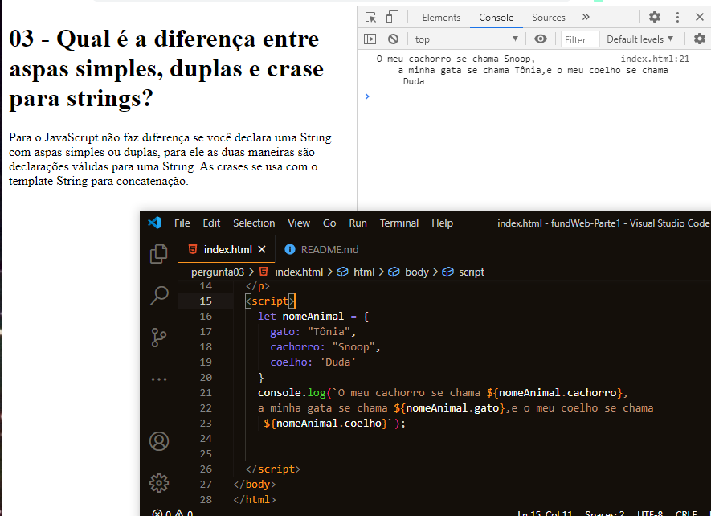
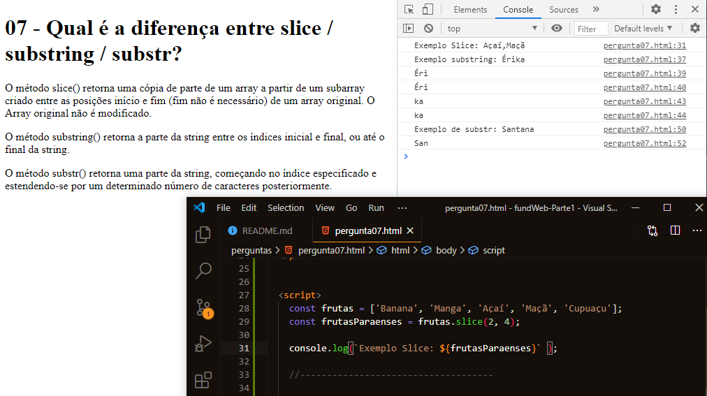
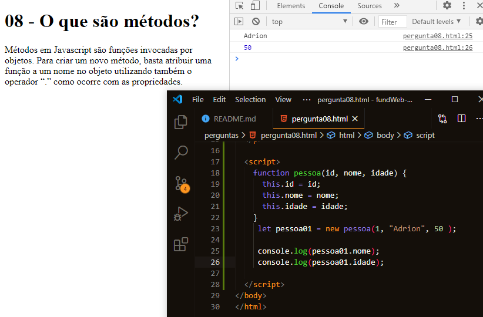
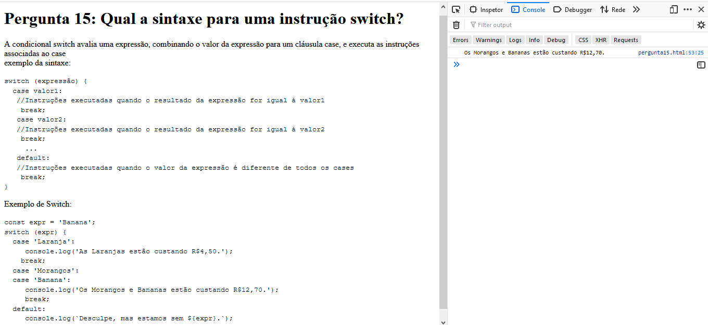
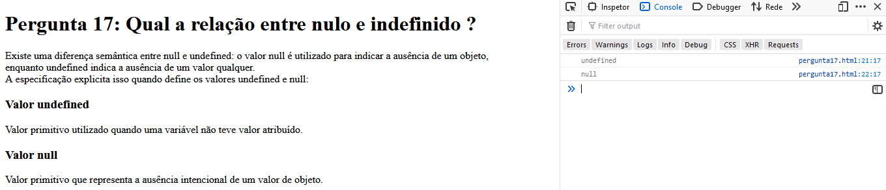
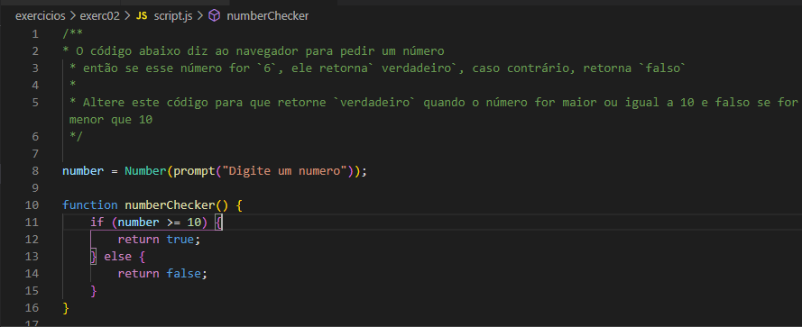

<h2>Perguntas - Parte 01</h2>
<h3>Respostas - Érika</h3>

<h3>Respostas - Raffael</h3>

<h2>Exercicios - parte 02</h2>
<h3>Respostas Raffael</h3>

Exercicio 01

A função abaixo deveria está registrando o número 2, porém não está,
veja se você consegue consertar! 
Certifique-se de corrigi-lo no espírito do código, não codifique o resultado permanentemente.

Resolução:  
Remover as apas das variáveis

Exercicio 02

O código abaixo diz ao navegador para pedir um número
então se esse número for `6`, ele retorna` verdadeiro`, caso contrário, retorna `falso`  
Altere este código para que retorne `verdadeiro` quando o número for maior ou igual a 10 e falso se for menor que 10

Fazendo a correção no código:

Antes:

Depois:

Resultado após alteração no código:

<h3>Respostas Érika</h3>

Exercicio 03

    Vamos fazer algumas contas:  
    Algumas regras primeiro: Não digite as respostas no slots abaixo, entre
    nas operações, faça o computador fazer o trabalho por você.

    a = um mais oito
    b = 22 vezes três
    c = o resto de 5/4
    d = a variável 'a' menos 17
    e = a soma das quatro variáveis ​​anteriores

Exercicio 04

Passo 1:
Dê uma olhada neste código e tente prever o que ele fará antes de executá-lo ... 

Depois de fazer seu palpite, pressione 'run' na parte superior
e dê uma olhada na saída no console. Se você ficou surpreso com
alguma coisa, volte e olhe o código para ver o que está acontecendo. 

Passo 2:
Depois de ter um bom controle do snippet de código, exclua o código
e siga as seguintes instruções entre as linhas e tente recriar o
snippet por conta própria. 

-4 variáveis: nome, sobrenome, ano atual e ano de nascimento.
uma 5ª variável (saudação) que é construída a partir das 4 anteriores, 
deve conter uma saudação com o nome completo da pessoa e sua idade.
imprima a saudação com console.log 

-
Depois de ter sua versão do código funcionando, vamos voltar a ela e
editá-la para torná-la mais fácil de ler. Após cada etapa, certifique-se 
de executar o código para garantir que ele ainda funcione! 

Etapa 3:
Adicione mais 2 variáveis: "fullName" e "idade" 

Edite a string de saudação para usar fullName e age em vez de fazer os 
cálculos na própria string. (a saudação deve ser semelhante
a: "Olá, meu nome é" + fullName) 

* NÃO digite simplesmente o nome completo e a idade nas novas variáveis, 
mas defina-as usando os cálculos que estavam sendo feitos originalmente 
na saudação. 

* observação - para fazer os testes passarem, você precisará usar 
esses valores exatos para os anos e nomes. O texto precisa ser exato.
 Se os testes falharem, verifique o espaçamento e a pontuação: 

birthYear = 1948
thisYear = 1965
firstName = Carlos
lastName = Stevenson

