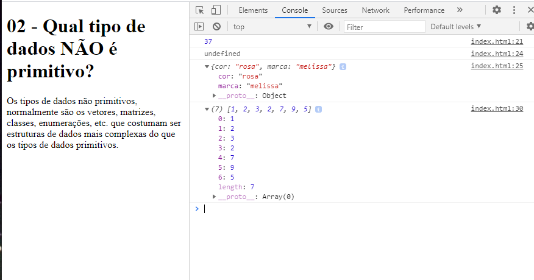
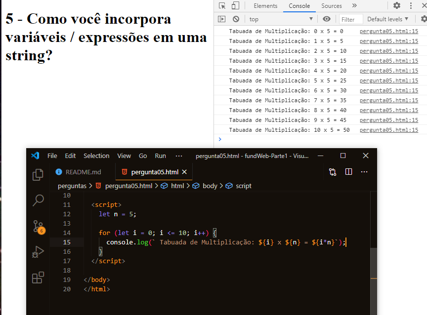
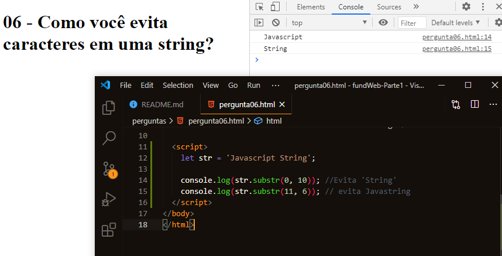
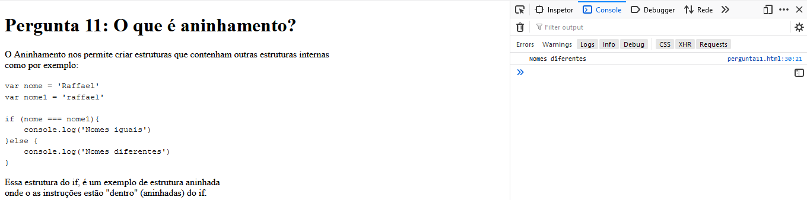
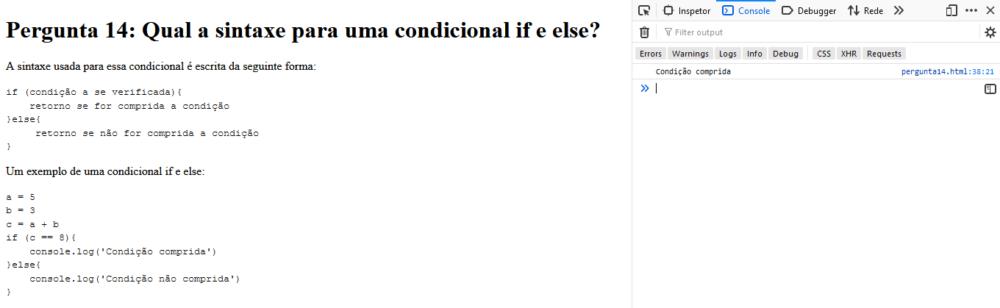

<h2>Perguntas - Parte 01</h2>
<h3>Respostas - Érika</h3>

<h3>Respostas - Raffael</h3>

<h2>Exercicios - parte 02</h2>
<h3>Respostas Raffael</h3>

<h3>Respostas Érika</h3>

Exercicio 03

    Vamos fazer algumas contas:  
    Algumas regras primeiro: Não digite as respostas no slots abaixo, entre
    nas operações, faça o computador fazer o trabalho por você.

    a = um mais oito
    b = 22 vezes três
    c = o resto de 5/4
    d = a variável 'a' menos 17
    e = a soma das quatro variáveis ​​anteriores

Exercicio 04

